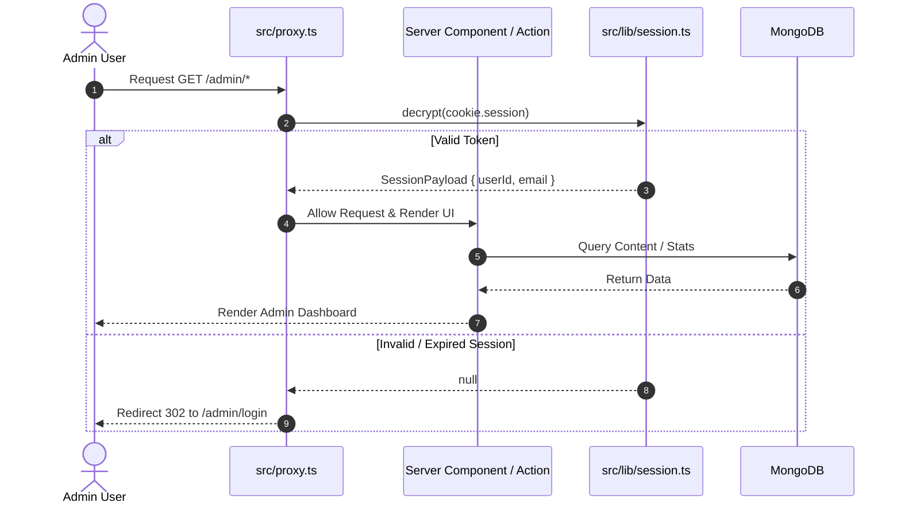

# 🛠️ Admin Panel System Design Specification

> **File Location:** `src/app/admin/DESIGN.md`  
> **Target System:** Portfolio & Personal Blog Admin Management  
> **Tech Stack:** Next.js 16 (App Router), React 19, Tailwind CSS v4, Framer Motion, MongoDB / Mongoose, TipTap Editor, Jose (JWT), AWS S3 / Resend.

---

## 📐 1. System Overview & Core Objectives

Dokumen ini mendefinisikan arsitektur teknis, panduan desain UI/UX, struktur data, dan sistem keamanan untuk **Admin Panel**. Admin panel dirancang sebagai *command center* yang bersih, cepat, dan intuitif untuk mengelola seluruh konten portofolio dan blog personal.

### Primary Goals:
1. **Clean Minimalist Monokromatik UI:** Mengusung estetika flat, border tipis, kontras tinggi, typography-focused, serta menghindari over-engineered blur/glassmorphic effects.
2. **Comprehensive Content Management:** Mengelola artikel blog, portofolio proyek, riwayat pengalaman kerja, keahlian teknis, konfigurasi hero & kontak, serta fitur baru: **Media Library Manager** & **Inbox Messages**.
3. **Robust Security & Operations:** Menggunakan HTTP-only JWT Session Cookies, server-side route protection melalui Middleware Proxy, validasi skema Zod, dan Next.js Server Actions yang aman.

---

## 🎨 2. Design System & Visual Style Guide

### 2.1 Aesthetic Principles
- **Theme:** Clean Minimalist Monochromatic (Dark / Light adaptation).
- **Surface & Borders:** Subtle 1px borders (`border-border`), flat background card solid without heavy drop shadows or backdrop-blur.
- **Typography:** `Inter` / System Sans-Serif sebagai font utama UI, `JetBrains Mono` untuk kode / identifier.
- **Accent & Contrast:** High contrast text (Charcoal / Pure Light White) dengan status indicator minimalis (Slate / Neutral Gray / Crimson for destructive).

### 2.2 Color Tokens (CSS Variable Mapping)

| Token | Light Mode | Dark Mode | Deskripsi |
| :--- | :--- | :--- | :--- |
| `--background` | `oklch(0.985 0.003 70)` | `oklch(0.18 0.002 70)` | Main background canvas |
| `--foreground` | `oklch(0.18 0.002 70)` | `oklch(0.985 0.003 70)` | Text utama & icon |
| `--card` | `oklch(0.99 0 0)` | `oklch(0.22 0.002 70)` | Card container flat |
| `--border` | `oklch(0.88 0 0)` | `oklch(0.28 0.002 70)` | Thin line divider & card borders |
| `--muted` | `oklch(0.94 0 0)` | `oklch(0.25 0.002 70)` | Muted badge & table hover state |
| `--muted-foreground` | `oklch(0.45 0 0)` | `oklch(0.65 0 0)` | Subtitle & placeholder text |
| `--primary` | `oklch(0.18 0.002 70)` | `oklch(0.985 0.003 70)` | Solid action buttons |

---

## 🗺️ 3. Information Architecture & Routing

```
src/app/admin/
├── layout.tsx              # Auth Check & Sidebar Layout Wrapper
├── page.tsx                # Dashboard Overview & Metrics
├── login/
│   └── page.tsx            # Admin Login Form
├── blog/
│   ├── page.tsx            # Post List Table & Filter
│   ├── new/page.tsx        # Create Post Editor (TipTap)
│   └── [id]/edit/page.tsx  # Update Post Editor
├── projects/
│   ├── page.tsx            # Project Management Grid
│   ├── new/page.tsx        # New Project Form
│   └── [id]/edit/page.tsx  # Edit Project Form
├── experience/
│   └── page.tsx            # Timeline Roles List & Modal
├── skills/
│   └── page.tsx            # Skill Categories & Badge Management
├── hero/
│   └── page.tsx            # Bio & Personal Branding Config
├── contact/
│   └── page.tsx            # Social Links & Email Config
├── media/                  # [NEW] Media & S3 Asset Library
│   └── page.tsx            # File Grid, Uploader & Asset Selector
├── inbox/                  # [NEW] Contact Form Messages Inbox
│   └── page.tsx            # Submissions List & Message Detail
└── settings/
    └── page.tsx            # Profile Email & Password Reset
```

---

## 🧱 4. Component Architecture

### 4.1 Admin Layout & Navigation (`AdminLayoutClient.tsx`)
- **Left Sidebar:** Flat sidebar dengan logo minimalis, daftar link navigasi dengan active indicator border, tombol toggle theme, dan profile menu + logout.
- **Top Bar:** Breadcrumbs halaman aktif, quick action button, status indikator koneksi database.
- **Content View:** Responsive grid dengan spacing teratur (`gap-6`, `p-8`).

### 4.2 Content Management Components
1. **TipTap Rich Text Editor (`RichTextEditor.tsx`):**
   - Clean floating/fixed toolbar dengan button monokrom.
   - Ekstensi: Code Block with Syntax Highlighting, Image Upload, Custom Link, Headings, Bullet Lists.
   - Markdown preview toggle.
2. **Data Table Component:**
   - Table header minimalis dengan sortir & pencarian.
   - Row action: Edit, Preview, Publish Toggle, Delete dengan konfirmasi dialog.
3. **Media Manager Modal / Page (`MediaLibrary.tsx`):**
   - Drag-and-drop file upload ke AWS S3.
   - Grid galeri gambar dengan opsi copy URL / select to editor.
4. **Inbox Viewer (`InboxManager.tsx`):**
   - Status pesan: *Unread*, *Read*, *Archived*.
   - Modal detail pesan & quick reply trigger via mailto.

---

## 🗄️ 5. Data Models & Database Schema

### 5.1 Main Entities (Mongoose Models)

#### 1. Blog Post Schema (`Post.ts`)
```typescript
interface IPost {
  title: string;
  slug: string;
  excerpt: string;
  content: string; // TipTap HTML / Markdown
  coverImage?: string;
  tags: string[];
  published: boolean;
  views: number;
  readingTime: string;
  createdAt: Date;
  updatedAt: Date;
}
```

#### 2. Project Schema (`Project.ts`)
```typescript
interface IProject {
  title: string;
  slug: string;
  description: string;
  longDescription?: string;
  coverImage: string;
  demoUrl?: string;
  githubUrl?: string;
  techStack: string[];
  featured: boolean;
  order: number;
}
```

#### 3. Inbox Message Schema (`InboxMessage.ts`) - *NEW*
```typescript
interface IInboxMessage {
  name: string;
  email: string;
  subject: string;
  message: string;
  read: boolean;
  createdAt: Date;
}
```

#### 4. Media Asset Schema (`MediaAsset.ts`) - *NEW*
```typescript
interface IMediaAsset {
  filename: string;
  url: string;
  key: string; // S3 Key
  size: number;
  mimeType: string;
  createdAt: Date;
}
```

---

## 🔒 6. Security, Authentication & Data Flow



### Security Standards:
1. **HTTP-only JWT Cookies:** Session disimpan menggunakan cookie `session` bertipe `httpOnly`, `sameSite: lax`, dan `secure` pada environment produksi.
2. **Server-side Validation:** Seluruh *Server Actions* & API endpoints memvalidasi payload menggunakan **Zod Schema** sebelum mengeksekusi mutasi ke MongoDB.
3. **Password Security:** Password admin di-hash menggunakan **bcryptjs** dengan *salt round* minimum 10.
4. **Input Sanitization:** Menghindari serangan XSS pada TipTap Editor HTML output.

---

## 🚀 7. Phased Implementation Roadmap

- [x] **Phase 1: Foundation & Core Routes**
  - Implementasi Layout Admin & Auth Check Proxy.
  - CRUD Blog Posts, Projects, Experience, & Skills.
- [ ] **Phase 2: UI/UX Minimalist Refactoring**
  - Penerapan styling Clean Monokromatik pada seluruh tabel & form.
  - Penyempurnaan TipTap Rich Text Editor & Image Toolbar.
- [ ] **Phase 3: New Feature Modules Expansion**
  - Pembangunan Modul **Media Library Manager** (AWS S3 Integration).
  - Pembangunan Modul **Inbox Messages** (Contact Submission Reader).
- [ ] **Phase 4: Optimization & Security Hardening**
  - Rate limiting pada form login & kontak.
  - Auto-cleanup orphaned S3 media assets.
